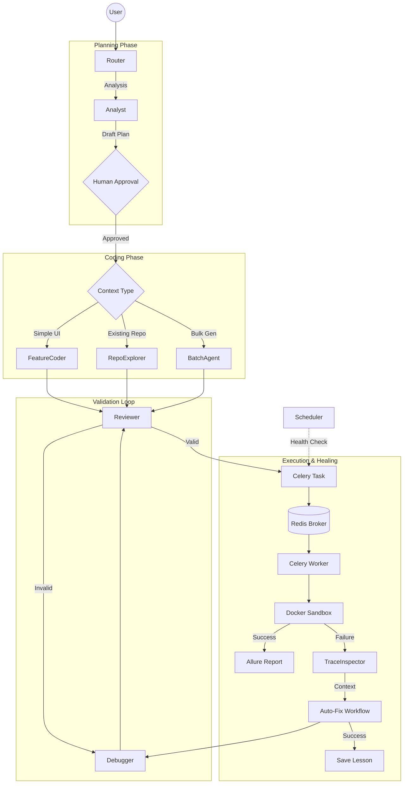

# TestOps Evolution Forge

**TestOps Evolution Forge** — это автономная мульти-агентная IDE на базе **Cloud.ru Evolution**, которая генерирует, исполняет, отлаживает и **самостоятельно поддерживает** автотесты.

Система имитирует работу Senior QA Automation инженера: она "видит" интерфейс через браузер, анализирует архитектуру проекта через AST, планирует сценарии тестирования и учится на собственных ошибках, сохраняя опыт в векторную базу знаний.

   

## 🚀 Killer Features

### 1. 🧠 Long-term Memory (Долгосрочная память)

Система не наступает на одни и те же грабли дважды.

* **Lesson Extraction:** После успешного исправления ошибки (`Auto-Fix`), агент формулирует краткий технический "урок" (например, *"В этом проекте для дропдаунов нужен force=True"*).
* **RAG Knowledge Base:** Уроки сохраняются в **ChromaDB**. При генерации новых тестов аналитик автоматически подтягивает релевантные знания, предотвращая повторение багов.

### 2. 🤝 Human-in-the-Loop (Контроль человека)

Вы управляете процессом, а не просто наблюдаете.

* **Test Plan Review:** Агент-Аналитик составляет детальный план тестирования перед написанием кода.
* **Approval Gate:** Процесс ставится на паузу, позволяя вам отредактировать план, добавить шаги или изменить логику через UI перед тем, как Coder начнет работу.

### 3. 👁️ Active Vision (Активное зрение)

Агент не гадает локаторы, а видит их.

1. Запускает Headless-браузер (Playwright) через сервис **WebInspector**.
2. Сканирует живой DOM, выделяя семантически важные элементы.
3. Извлекает реальные `data-testid`, `id`, `class` и ARIA-атрибуты.
4. Генерирует код, который работает с первого запуска.

### 4. ⚡ Parallel Batch Generation (Пакетная генерация)

Нужно покрыть тестами весь функционал сразу?

* Аналитик разбивает сложный запрос (например, *"Протестируй весь флоу покупки"*) на атомарные сценарии.
* Система запускает генерацию кода для каждого сценария **параллельно**, кратно ускоряя процесс.

### 5. 🐙 Repo Explorer (Агент-Исследователь)

Для сложных интеграционных тестов включается режим **ReAct**:

* Агент получает инструменты `read_file`, `search_code` и `file_tree`.
* Он самостоятельно навигирует по вашему Git-репозиторию, изучает существующие Page Objects, модели и API-клиенты, чтобы переиспользовать код проекта.

### 6. ⏰ Autonomous Maintenance (Самоисцеление)

Встроенный **Scheduler** работает, пока вы спите:

* Каждые 6 часов запускает "Health Check" для существующих тестов.
* При падении активируется **Trace Inspector**: он распаковывает `trace.zip`, извлекает DOM-снепшот в момент ошибки, сетевые логи и ошибки консоли.
* **Debugger Agent** анализирует контекст, исправляет тест и уведомляет вас о починке.

### 7. 🛡️ Smart Quality Gate

Многоступенчатая валидация перед сохранением кода:

* **Security Check:** AST-анализ блокирует опасные импорты (`os`, `subprocess`, `sys`).
* **Strict Linter:** Авто-форматирование через `ruff`, проверка наличия Allure-декораторов.
* **Locator Dry Run:** "Пробный прогон" найденных локаторов на живой странице для исключения галлюцинаций.

---

## 🏗 Архитектура

Проект построен на **LangGraph** (оркестрация агентов), **Celery/Redis** (асинхронные задачи) и **Docker-in-Docker** (изоляция исполнения).



### Инфраструктура

* **Frontend:** Nginx раздает статику (React SPA) и проксирует API.
* **Backend:** FastAPI сервис управляет графом агентов (LangGraph) и стримингом событий (SSE).
* **Worker:** Отдельный контейнер для исполнения тестов, чтобы не блокировать API.
* **DinD (Docker-in-Docker):** Тесты запускаются в эфемерных контейнерах `testops-runner`, которые уничтожаются после прогона.

---

## 🛠 Технологический Стек

| Уровень | Технологии |
|-----------|------------|
| **Frontend** | React 19, Vite 7, Tailwind CSS v4, Zustand 5, Monaco Editor |
| **Backend** | Python 3.11, FastAPI, Pydantic, SQLAlchemy 2.0 (Async) |
| **AI Core** | LangGraph, LangChain, Cloud.ru Evolution (Qwen 2.5/3 Coder) |
| **Async & Broker** | Celery, Redis (Pub/Sub для стриминга логов) |
| **Database** | PostgreSQL (History), ChromaDB (Vector Memory) |
| **Testing Engine** | Playwright, Pytest, Allure |
| **Code Analysis** | AST (Python), JavaParser, Regex (JS/TS), Tree-Sitter |

---

## 🏃‍♂️ Быстрый старт

### Предварительные требования

* Docker & Docker Compose
* API Key от Cloud.ru Evolution (или любого OpenAI-compatible провайдера)

### Установка и Запуск

1. **Клонируйте репозиторий:**

    ```bash
    git clone https://github.com/ShutovKS/copilot-audit.git
    cd copilot-audit
    ```

2. **Настройте окружение:**
    Создайте файл `backend/.env` на основе примера:

    ```bash
    cp backend/.env.example backend/.env
    ```

    *Отредактируйте `backend/.env`, указав ваш `CLOUD_RU_API_KEY`.*

3. **Запустите стек:**

    ```bash
    docker-compose up --build -d --force-recreate
    ```

4. **Доступ к сервисам:**
    * 💻 **Frontend:** `http://localhost`
    * 🔌 **Backend API:** `http://localhost:8000/docs`
    * 📊 **Allure Reports:** Доступны внутри UI после прогона тестов.

---

## 🔄 Сценарии использования

### 1. UI Test Generation

* **Промпт:** *"Напиши тест авторизации для <https://example.com>. Проверь валидацию некорректного email."*
* **Результат:** Система зайдет на сайт, изучит DOM и сгенерирует тест на Playwright.

### 2. Repository Analysis (White-Box)

* **Действие:** Нажмите кнопку 📎 (Upload ZIP) или иконку Git, укажите ссылку на репозиторий.
* **Промпт:** *"Используй PageObjects из репозитория и напиши тест для добавления товара в корзину."*
* **Результат:** Агент найдет существующие классы страниц и использует их методы.

### 3. Auto-Fix

* **Ситуация:** Вы запустили тест, и он упал.
* **Действие:** Нажмите кнопку **Auto-Fix** в редакторе.
* **Результат:** Агент-Отладчик проанализирует логи, скриншоты и трейсы, перепишет код и предложит исправление.

### 4. GitLab Export

* **Действие:** Тест работает идеально? Нажмите **Export**.
* **Результат:** Система создаст ветку и Merge Request в вашем GitLab проекте.

---

*Built with ❤️ by Team NonSleepers for TestOps Evolution Hackathon*
