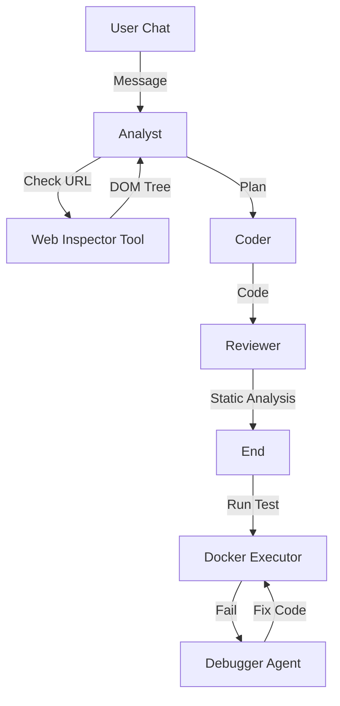

# TestOps Evolution Forge

**TestOps Evolution Forge** — это автономная Agentic-система на базе **Cloud.ru Evolution**, которая не просто генерирует тесты, а **видит** интерфейс, **понимает** контекст и **чинит** сама себя.

  

## 🚀 Killer Features

### 1. 👁️ Active Vision (Зрение Агента)
Агент не гадает локаторы. Если вы дадите ему ссылку (например, `https://cloud.ru/calculator`), он:
1.  Запустит Headless-браузер (Playwright).
2.  Просканирует DOM-дерево.
3.  Извлечет реальные `data-testid`, `id` и `class`.
4.  Напишет тест, который **сразу работает**.

### 2. 💬 Conversational Interface (Чат-режим)
Забудьте о "генерации в один клик". Работайте с AI как с коллегой:
*   *"Сгенерируй тест для логина"*
*   *"Добавь проверку на пустой пароль"*
*   *"Перепиши на Page Object Model"*

Система помнит контекст диалога и правит код на лету.

### 3. 🔧 Self-Healing (Авто-починка)
Тест упал? Не проблема.
1.  Система анализирует логи ошибок (`TimeoutError`, `AssertionError`).
2.  Вы нажимаете кнопку **Auto-Fix**.
3.  Специализированный `Debugger Agent` изучает StackTrace и исправляет код.

### 4. 🛡️ Smart Quality Gate
Мы гарантируем валидность кода:
*   **Static POM Validator:** Проверяет, что вы не вызываете несуществующие методы у Page Objects.
*   **Security Linter:** Блокирует опасные импорты (`os`, `subprocess`).
*   **Style Check:** Форматирование через `ruff`.

## 🏗 Архитектура

Система построена на графе агентов (**LangGraph**):



## 🛠 Технологии

*   **Backend:** Python 3.11, FastAPI, LangGraph, SQLAlchemy (Async), Playwright.
*   **Frontend:** React 18, Vite, Tailwind CSS, Monaco Editor, Zustand.
*   **AI:** Cloud.ru Evolution (Qwen 2.5/3 Coder).
*   **Infra:** Docker Compose.

## 🏃‍♂️ Быстрый старт

1.  **Настройка**
    Создайте `backend/.env`:
    ```ini
    CLOUD_RU_API_KEY=your_key
    CLOUD_RU_BASE_URL=https://foundation-models.api.cloud.ru/v1
    MODEL_NAME=Qwen/Qwen2.5-Coder-32B-Instruct
    ```

2.  **Запуск**
    ```bash
    docker-compose up --build -d
    ```

3.  **Использование**
    *   Откройте [http://localhost:3000](http://localhost:3000).
    *   В чате напишите: `Напиши тест для https://example.com`.
    *   Наслаждайтесь магией.
