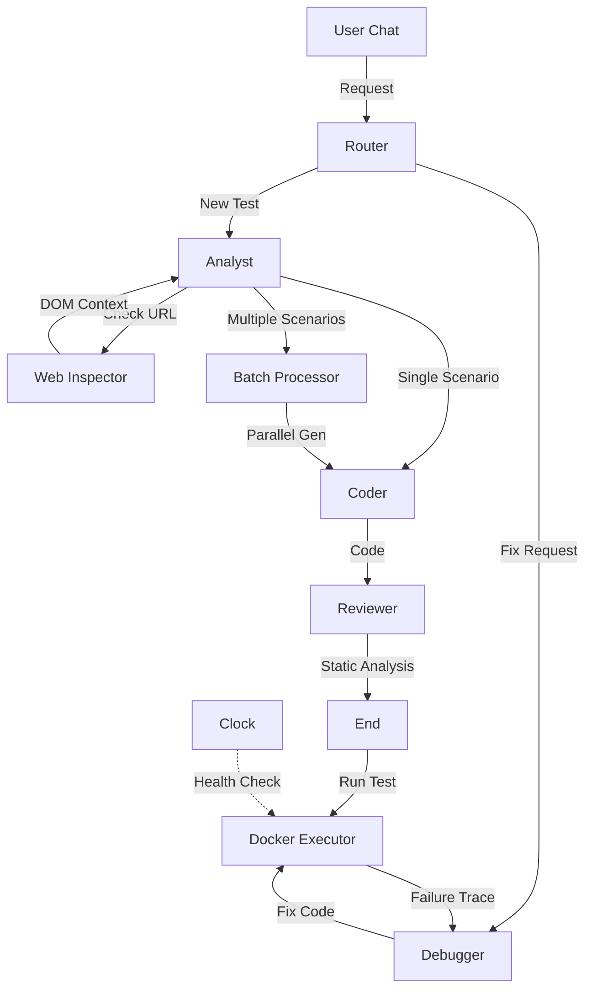

# TestOps Evolution Forge

**TestOps Evolution Forge** — это автономная мульти-агентная система на базе **Cloud.ru Evolution**, которая генерирует, исполняет, отлаживает и **самостоятельно поддерживает** автотесты. Она умеет **видеть** интерфейс, **анализировать** репозитории кода и работать в фоновом режиме.

   

## 🚀 Killer Features

### 1. 👁️ Active Vision (Зрение Агента)

Агент не гадает локаторы. Если вы дадите ему ссылку (например, `https://cloud.ru/calculator`), он:

1. Запустит Headless-браузер (Playwright).
2. Просканирует DOM-дерево, выделяя **семантически важные** элементы.
3. Извлечет реальные `data-testid`, `id` и `class`.
4. Напишет UI-тест, который **сразу работает**.

### 2. ⏰ Autonomous Maintenance (Автономное Обслуживание)

Система не спит, когда вы отдыхаете. Встроенный **Scheduler**:

* Каждые 6 часов запускает "Health Check" для существующих тестов.
* Если тест упал (изменилась верстка или API), система **автоматически** запускает агента отладки.
* Вы получаете уведомление уже о том, что тест был **починен**.

### 3. 📦 White-Box Analysis (Анализ Кода)

Система понимает не только UI, но и внутреннюю структуру вашего проекта.

* **Deep Parsing:** Поддержка Python (AST), Java (Spring), JS/TS (NestJS, Express).
* **Smart Context:** Загрузите ZIP или ссылку на Git — агент построит карту эндпоинтов и моделей данных, чтобы написать точные API-тесты.

### 4. ⚡ Parallel Batch Generation

Нужно покрыть тестами весь функционал?

* Агент-Аналитик умеет разбивать сложные задачи на независимые сценарии.
* Система генерирует код для нескольких сценариев **параллельно**, экономя ваше время.

### 5. 🔧 Self-Healing & Debug Inspector

Тест упал?

1. Система запускает тест в Docker-контейнере.
2. При падении собирается **Trace Context**: скриншот, сеть, логи консоли.
3. **Debugger Agent** анализирует трейс, выдвигает гипотезу и правит код.

### 6. 🛡️ Smart Quality Gate

Гарантия качества кода:

* **Static POM Validator:** Проверяет согласованность методов Page Object.
* **Security Linter:** Блокирует опасные импорты (`os`, `subprocess`).
* **Style Check:** Форматирование через `ruff`.
* **Deduplication:** Векторный поиск (ChromaDB) предотвращает дубликаты.

## 🏗 Архитектура

Система построена на оркестраторе **LangGraph** с поддержкой циклических графов:



## 🛠 Технологический Стек

### Backend

* **Core:** Python 3.11, FastAPI
* **AI Orchestration:** LangGraph, LangChain
* **Testing Engine:** Playwright, Pytest, Allure
* **Data:** PostgreSQL (Async), ChromaDB (Vector Search)
* **Parsers:** Python AST, JavaParser, Tree-Sitter

### Frontend

* **Framework:** React 19, Vite 7
* **Styling:** Tailwind CSS v4 (Cloud.ru Console Theme)
* **State:** Zustand 5 (Persisted)
* **Editor:** Monaco Editor (VS Code core)
* **Streaming:** Server-Sent Events (SSE)

### Supported Models

* **Primary:** Qwen 2.5/3 Coder (via Cloud.ru)
* **Alternative:** GigaChat Max, T-Pro, MiniMax, OpenAI GPT-4o

## 🏃‍♂️ Быстрый старт

1. **Настройка**
    Создайте файл `backend/.env`:

    ```ini
    CLOUD_RU_API_KEY=your_key
    CLOUD_RU_BASE_URL=https://foundation-models.api.cloud.ru/v1
    MODEL_NAME=Qwen/Qwen3-Coder-480B-A35B-Instruct
    ```

2. **Запуск**

    ```bash
    docker-compose up --build -d
    ```

3. **Использование**
    * Откройте **<http://localhost>** (порт 80).
    * В чате напишите: `Напиши тест для https://example.com` или загрузите ZIP с кодом.

## 🔄 Интеграции

* **GitLab:** Экспорт готовых тестов в Merge Request.
* **Allure:** Встроенный просмотр отчетов.
* **Notification Center:** Уведомления об авто-починке тестов.
