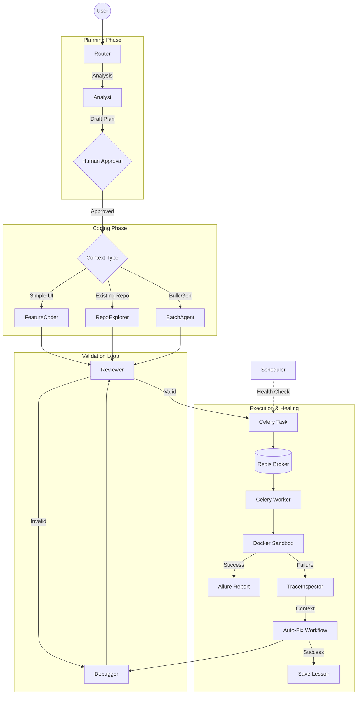

# TestOps Evolution Forge

[Русский](./README.ru.md) | [English](./README.md)

**TestOps Evolution Forge** is an autonomous multi-agent IDE built on **Cloud.ru Evolution** that generates, executes, debugs, and **self-maintains** automated tests.

The system simulates the work of a Senior QA Automation engineer: it "sees" the interface through a browser, analyzes the project architecture via AST, plans test scenarios, and learns from its own mistakes by storing experience in a vector knowledge base.

   

## 🚀 Killer Features

### 1. 🧠 Long-term Memory

The system doesn't make the same mistake twice.

* **Lesson Extraction:** After a successful bug fix (`Auto-Fix`), the agent formulates a brief technical "lesson" (e.g., *"In this project, dropdowns need force=True"*).
* **RAG Knowledge Base:** Lessons are stored in **ChromaDB**. When generating new tests, the analyst automatically pulls in relevant knowledge, preventing recurring bugs.

### 2. 🤝 Human-in-the-Loop

You control the process rather than just watching.

* **Test Plan Review:** The Analyst agent builds a detailed test plan before writing code.
* **Approval Gate:** The process pauses, letting you edit the plan, add steps, or change logic via the UI before the Coder starts working.

### 3. 👁️ Active Vision

The agent doesn't guess locators — it sees them.

1. Launches a headless browser (Playwright) via the **WebInspector** service.
2. Scans the live DOM, highlighting semantically important elements.
3. Extracts real `data-testid`, `id`, `class`, and ARIA attributes.
4. Generates code that works on the first run.

### 4. ⚡ Parallel Batch Generation

Need to cover all functionality with tests at once?

* The analyst splits a complex request (e.g., *"Test the entire purchase flow"*) into atomic scenarios.
* The system runs code generation for each scenario **in parallel**, drastically speeding up the process.

### 5. 🐙 Repo Explorer

For complex integration tests, a **ReAct** mode is enabled:

* The agent gets the `read_file`, `search_code`, and `file_tree` tools.
* It autonomously navigates your Git repository, studies existing Page Objects, models, and API clients to reuse the project's code.

### 6. ⏰ Autonomous Maintenance (Self-healing)

A built-in **Scheduler** works while you sleep:

* Every 6 hours it runs a "Health Check" for existing tests.
* On failure, the **Trace Inspector** activates: it unpacks `trace.zip`, extracts the DOM snapshot at the moment of the error, network logs, and console errors.
* The **Debugger Agent** analyzes the context, fixes the test, and notifies you of the repair.

### 7. 🛡️ Smart Quality Gate

Multi-stage validation before saving code:

* **Security Check:** AST analysis blocks dangerous imports (`os`, `subprocess`, `sys`).
* **Strict Linter:** Auto-formatting via `ruff`, checks for Allure decorators.
* **Locator Dry Run:** A "trial run" of found locators on the live page to rule out hallucinations.

---

## 🏗 Architecture

The project is built on **LangGraph** (agent orchestration), **Celery/Redis** (async tasks), and **Docker-in-Docker** (execution isolation).


```mermaid
graph TD
    User((User)) --> Router
    
    subgraph "Planning Phase"
        Router -->|Analysis| Analyst
        Analyst -->|Draft Plan| HumanGate{Human Approval}
    end

    subgraph "Coding Phase"
        HumanGate -->|Approved| Routing{Context Type}
        Routing -->|Simple UI| FeatureCoder
        Routing -->|Existing Repo| RepoExplorer
        Routing -->|Bulk Gen| BatchAgent
    end

    subgraph "Validation Loop"
        FeatureCoder --> Reviewer
        RepoExplorer --> Reviewer
        BatchAgent --> Reviewer
        Reviewer -->|Invalid| Debugger
        Debugger --> Reviewer
    end

    subgraph "Execution & Healing"
        Reviewer -->|Valid| QueueTask[Celery Task]
        QueueTask --> Redis[(Redis Broker)]
        Redis --> Worker[Celery Worker]
        Worker --> Executor[Docker Sandbox]
        Executor -->|Success| Report[Allure Report]
        Executor -->|Failure| TraceInspector
        TraceInspector -->|Context| AutoFix[Auto-Fix Workflow]
        AutoFix --> Debugger
        AutoFix -->|Success| Memory[Save Lesson]
    end

    Scheduler -.->|Health Check| QueueTask
```

### Infrastructure

* **Frontend:** Nginx serves static files (React SPA) and proxies the API.
* **Backend:** A FastAPI service manages the agent graph (LangGraph) and event streaming (SSE).
* **Worker:** A separate container for executing tests so it doesn't block the API.
* **DinD (Docker-in-Docker):** Tests run in ephemeral `testops-runner` containers that are destroyed after a run.

---

## 🛠 Tech Stack

| Layer | Technologies |
|-----------|------------|
| **Frontend** | React 19, Vite 7, Tailwind CSS v4, Zustand 5, Monaco Editor |
| **Backend** | Python 3.11, FastAPI, Pydantic, SQLAlchemy 2.0 (Async) |
| **AI Core** | LangGraph, LangChain, Cloud.ru Evolution (Qwen 2.5/3 Coder) |
| **Async & Broker** | Celery, Redis (Pub/Sub for log streaming) |
| **Database** | PostgreSQL (History), ChromaDB (Vector Memory) |
| **Testing Engine** | Playwright, Pytest, Allure |
| **Code Analysis** | AST (Python), JavaParser, Regex (JS/TS), Tree-Sitter |

---

## 🏃‍♂️ Quick start

### Prerequisites

* Docker & Docker Compose
* An API Key for Cloud.ru Evolution (or any OpenAI-compatible provider)

### Installation and running

1. **Clone the repository:**

    ```bash
    git clone https://github.com/ShutovKS/copilot-audit.git
    cd copilot-audit
    ```

2. **Configure the environment:**
    Create a `backend/.env` file based on the example:

    ```bash
    cp backend/.env.example backend/.env
    ```

    *Edit `backend/.env` and provide your `CLOUD_RU_API_KEY`.*

3. **Start the stack:**

    ```bash
    docker-compose up --build -d --force-recreate
    ```

4. **Access the services:**
    * 💻 **Frontend:** `http://localhost`
    * 🔌 **Backend API:** `http://localhost:8000/docs`
    * 📊 **Allure Reports:** Available inside the UI after a test run.

---

## 🔄 Use cases

### 1. UI Test Generation

* **Prompt:** *"Write an authorization test for <https://example.com>. Check the validation for an invalid email."*
* **Result:** The system visits the site, studies the DOM, and generates a Playwright test.

### 2. Repository Analysis (White-Box)

* **Action:** Click the 📎 (Upload ZIP) button or the Git icon, and provide a repository link.
* **Prompt:** *"Use the PageObjects from the repository and write a test for adding a product to the cart."*
* **Result:** The agent finds existing page classes and uses their methods.

### 3. Auto-Fix

* **Situation:** You ran a test and it failed.
* **Action:** Click the **Auto-Fix** button in the editor.
* **Result:** The Debugger agent analyzes the logs, screenshots, and traces, rewrites the code, and suggests a fix.

### 4. GitLab Export

* **Action:** The test works perfectly? Click **Export**.
* **Result:** The system creates a branch and a Merge Request in your GitLab project.

---

*Built with ❤️ by Team NonSleepers for TestOps Evolution Hackathon*
