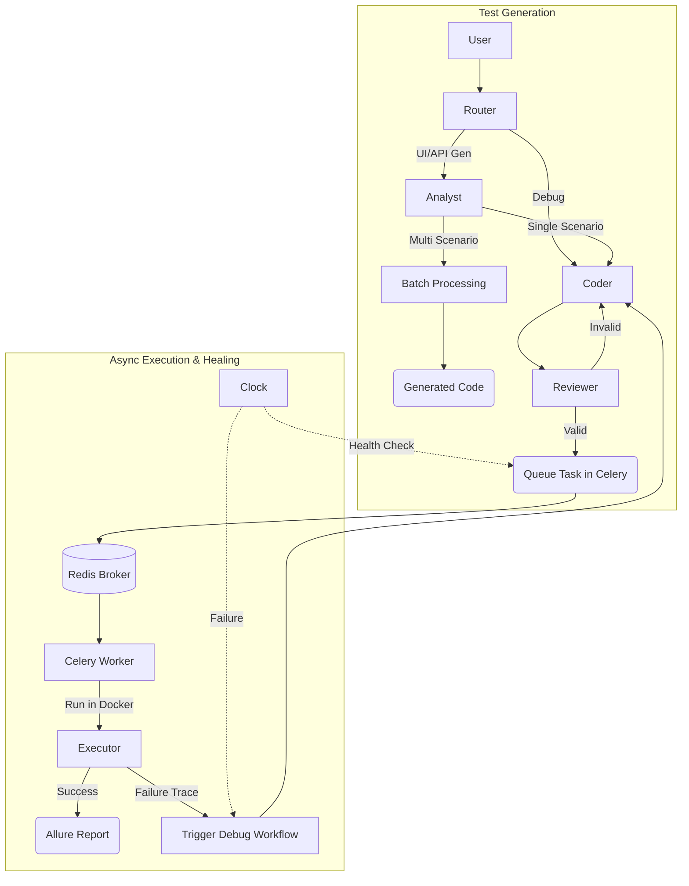

# TestOps Evolution Forge Backend

Backend-сервис для автономной генерации, валидации и самовосстановления автотестов. Построен на базе мульти-агентной архитектуры (LangGraph) и использует LLM (Cloud.ru Evolution) для создания надежного кода на Python (Pytest + Playwright).

## 🚀 Ключевые возможности

### 1. Мульти-агентная генерация (LangGraph)

Система не просто «пишет код», а имитирует работу QA-команды. Состояние передается между узлами графа:

- **Router**: Классифицирует запросы с помощью быстрой модели (`Qwen-Next-80B`), направляя их на генерацию, дебаг или анализ репозитория.
- **Analyst**: Формирует детальный план тестирования. Использует RAG (Deduplication Service), историю дефектов и парсинг документации.
- **Coder (ReAct Mode)**: Агент, способный **активно исследовать** репозиторий. Использует инструменты `CodebaseNavigator` (`read_file`, `search_code`) в цикле (до 7 итераций), чтобы понять контекст проекта перед написанием кода.
- **Batch Agent**: Параллельно генерирует код для нескольких сценариев, если Analyst выделил множество тест-кейсов.
- **Reviewer**: Выполняет многоступенчатую валидацию:
  1. **Auto-Formatting**: Форматирование кода через `Ruff`.
  2. **Security Check**: AST-анализ на наличие запрещенных импортов (`os`, `subprocess`, `eval`).
  3. **Strict Linter**: Проверка наличия Allure-декораторов и соблюдения Page Object Model (POM).

### 2. Глубокий анализ кода (Reverse Engineering)

Сервис умеет клонировать Git-репозитории или принимать ZIP-архивы для построения контекста ("Карты проекта"):

- **Python**: Парсинг FastAPI/Starlette (Native AST).
- **Java**: Парсинг Spring Boot контроллеров (AST `javalang` с фоллбэком на Regex).
- **JavaScript/TypeScript**: Поддержка NestJS и Express (Regex).

### 3. Интеллектуальная работа с UI (WebInspector)

Для UI-тестов агент не «гадает» локаторы:

- **Live Inspection**: Агент заходит на целевую страницу через Playwright (Headless).
- **DOM Analysis**: Извлекает семантическую структуру (IDs, `data-testid`, классы), игнорируя визуальный шум.
- **Locator Dry Run**: Reviewer выполняет «пробный прогон» найденных локаторов на живой странице перед сохранением кода, отсеивая галлюцинации.

### 4. Изолированное исполнение и отчетность

- **Custom Runner**: Система автоматически собирает и кэширует Docker-образ `testops-runner`, содержащий Python, Java (Allure), Playwright и браузеры.
- **Sandbox**: Каждый тест запускается в эфемерном контейнере, полностью изолированном через Docker-in-Docker (DinD) подход, с жесткими лимитами на CPU, память и процессы для защиты системы от перегрузок и вредоносного кода. Монтирование томов используется для обмена файлами.
- **Allure Reporting**: Автоматическая генерация отчетов, хостинг статики и очистка результатов.

### 5. Самовосстановление (Self-Healing & Debugging)

- **Trace Inspector**: При падении теста система анализирует `trace.zip`, извлекая DOM-снепшот момента падения, сетевые ошибки и логи консоли.
- **Auto-Fix Workflow**: Агент получает полный контекст ошибки, формулирует гипотезу (`# HYPOTHESIS: ...`) и переписывает код.
- **Smart Scheduler**: Фоновая задача (на базе `APScheduler`) каждые 6 часов прогоняет успешные тесты. Если тест падает ("флакует" или изменился UI), шедулер **автоматически триггерит граф восстановления** и отправляет уведомление.

### 6. Вспомогательные инструменты

- **Prompt Enhancer**: Переписывает короткие запросы пользователя в структурированные инструкции для LLM.
- **GitLab Integration**: Экспорт тестов в Merge Request с созданием ветки и коммита.
- **Deduplication**: Векторный поиск (ChromaDB) по семантике запроса для предотвращения дубликатов кода.

---

## 🏗 Архитектура

Проект построен на **FastAPI** и использует **LangGraph** для управления состоянием агентов **генерации** тестов, а **Celery** и **Redis** для их **асинхронного выполнения** и **потоковой передачи логов**.



### Основные модули

- `src/app/agents/` — Логика агентов (Graph, Nodes, Prompts).
- `src/app/services/code_analysis/` — Парсеры исходного кода (Java/Python/JS).
- `src/app/services/tools/` — Инструментарий (Linter, WebInspector, TraceInspector).
- `src/app/services/executor.py` — Оркестрация Docker-контейнеров (Docker-in-Docker).
- `src/app/services/scheduler.py` — Планировщик фоновых задач Health Check.
- `src/app/core/celery_app.py` — Конфигурация Celery.
- `src/app/core/redis.py` — Настройка клиента Redis для Pub/Sub.
- `src/app/tasks.py` — Celery-задачи для асинхронного выполнения.

---

## 🛠 Технологический стек

- **Language**: Python 3.11
- **Framework**: FastAPI
- **AI/LLM**: Cloud.ru Evolution
  - *Router*: `Qwen/Qwen3-Next-80B-A3B-Instruct`
  - *Coder/Analyst*: `Qwen/Qwen3-Coder-480B-A35B-Instruct`
- **Orchestration**: LangChain, LangGraph
- **Task Queue**: Celery, Redis
- **Task Scheduling**: APScheduler
- **Linting**: Ruff (Formatter/Linter), AST (Security)
- **Database**: PostgreSQL (Asyncpg + SQLAlchemy)
- **Vector DB**: ChromaDB (Semantic Search)
- **Testing Engine**: Pytest, Playwright, Allure
- **Infrastructure**: Docker

---

## ⚙️ Установка и запуск

Все компоненты сервиса (backend, frontend, worker, redis, базы данных, dind) запускаются с помощью Docker Compose.

### Предварительные требования

- Docker & Docker Compose

### Запуск

Для запуска всего приложения:

```bash
docker-compose up --build -d
```

Приложение будет доступно по адресу `http://localhost`.

---

## 🔌 API Endpoints

Полная документация доступна по адресу `/docs` (Swagger UI).

### Генерация и Чат

| Метод | Эндпоинт | Описание |
|-------|----------|----------|
| **POST** | `/api/v1/generate` | Streaming-генерация тестов (SSE) |
| **POST** | `/api/v1/chat/message` | Чат с агентом (уточнение требований) |
| **POST** | `/api/v1/chat/reset` | Сброс сессии (очистка временных файлов) |
| **POST** | `/api/v1/enhance` | Улучшение пользовательского промпта через LLM |
| **GET** | `/api/v1/models` | Список доступных моделей |

### Исполнение и Отладка

| Метод | Эндпоинт | Описание |
|-------|----------|----------|
| **POST** | `/api/v1/execution/{id}/run` | Запуск сгенерированного теста (Docker) |
| **GET** | `/api/v1/execution/{id}/debug-context` | Получение контекста ошибки (Trace Analysis) |

### Анализ и История

| Метод | Эндпоинт | Описание |
|-------|----------|----------|
| **POST** | `/api/v1/analyze-source` | Анализ ZIP-архива с исходным кодом |
| **POST** | `/api/v1/analyze-git` | Клонирование и анализ Git-репозитория |
| **GET** | `/api/v1/history/` | История запусков и генераций |
| **GET** | `/api/v1/notifications/` | Уведомления (в т.ч. о самовосстановлении) |

### Экспорт

| Метод | Эндпоинт | Описание |
|-------|----------|----------|
| **POST** | `/api/v1/export/gitlab` | Экспорт теста в GitLab MR |
