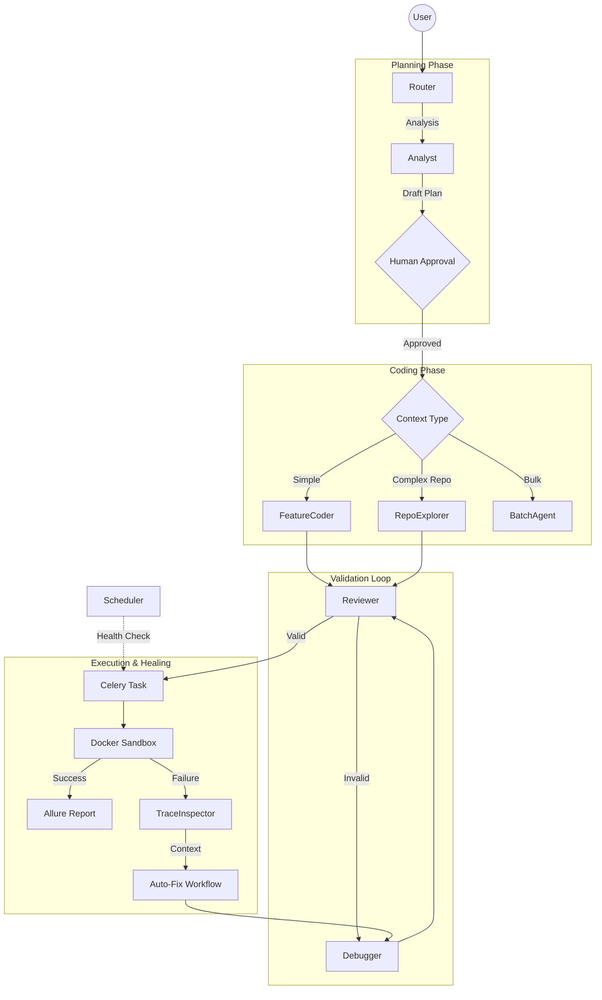

# TestOps Evolution Forge Backend

Backend-сервис для автономной генерации, валидации, исполнения и самовосстановления автотестов.

Проект построен на базе мульти-агентной архитектуры (**LangGraph**) и использует большие языковые модели (**Cloud.ru Evolution / Qwen**) для создания надежного кода на Python (Pytest + Playwright). Система имитирует работу реального QA-инженера: от анализа требований до ревью кода, запоминания ошибок и автоматической отладки.

## 🚀 Ключевые возможности

### 1. Мульти-агентная архитектура (LangGraph)

Система управляет состоянием генерации через направленный граф, где каждый узел — это специализированный AI-агент:

- **Router**: Классифицирует запросы (UI-тест, API-тест, Дебаг, Вопрос по коду), выбирая оптимальный маршрут выполнения.
- **Analyst**: Формирует детальный план тестирования (`Test Plan`). Использует RAG, историю дефектов и парсинг документации.
- **Human-in-the-Loop (HITL)**: Критическая точка контроля. Система приостанавливает выполнение после этапа анализа, позволяя пользователю утвердить или скорректировать план тестирования перед началом написания кода.
- **Coder (Dual Mode)**:
  - *Feature Coder*: Быстрая генерация кода для изолированных сценариев.
  - *Repo Explorer (ReAct)*: Агент-исследователь. Использует инструменты `CodebaseNavigator` (`read_file`, `search_code`) для навигации по репозиторию пользователя и понимания контекста проекта.
- **Reviewer**: Выполняет многоступенчатую валидацию:
  1. **Auto-Formatting**: Форматирование через `Ruff`.
  2. **Security Check**: AST-анализ на наличие запрещенных импортов и опасных вызовов (`os`, `subprocess`, `eval`).
  3. **Strict Linter**: Проверка наличия Allure-декораторов, соблюдения Page Object Model (POM) и отсутствия хардкода.
  4. **Locator Dry Run**: "Пробный прогон" найденных локаторов на живой странице через WebInspector для исключения галлюцинаций.
- **Debugger**: Специализированный агент для исправления ошибок. Анализирует логи валидации или трейсы выполнения и переписывает код.

### 2. Долгосрочная память (Long-term Memory)

Сервис обладает способностью к обучению (реализовано в `KnowledgeBaseService`):

- **Lesson Extraction**: После успешного исправления ошибки (`Auto-Fix`), система формулирует краткий технический "урок" (например, *"На этом проекте для дропдаунов нужен force=True"*).
- **Knowledge Base**: Уроки сохраняются в отдельную коллекцию векторной базы (ChromaDB `qa_insights`).
- **Context Injection**: При генерации новых тестов Analyst автоматически подтягивает релевантные "уроки" из прошлого, предотвращая повторение одних и тех же ошибок на проекте.

### 3. Глубокий анализ кода (Reverse Engineering)

Сервис умеет клонировать Git-репозитории или принимать ZIP-архивы для построения "Карты проекта":

- **Python**: Парсинг FastAPI/Starlette (Native AST).
- **Java**: Парсинг Spring Boot контроллеров (AST `javalang` + Regex fallback).
- **JavaScript/TypeScript**: Поддержка NestJS и Express.

### 4. Изолированное исполнение (Sandbox)

- **Docker-in-Docker (DinD)**: Каждый тест запускается в одноразовом, полностью изолированном контейнере `testops-runner`.
- **Remote Browsers**: Поддержка подключения к удаленным браузерам (Playwright Server) или запуск Headless-браузера внутри контейнера.
- **Allure Reporting**: Автоматическая генерация отчетов, создание артефактов (видео, скриншоты, трейсы) и хостинг статики.

### 5. Самовосстановление (Self-Healing)

- **Trace Inspector**: При падении теста система распаковывает `trace.zip`, извлекает DOM-снепшот в момент ошибки, сетевые логи и ошибки консоли браузера.
- **Auto-Fix Workflow**: Агент получает полный контекст ошибки, формулирует гипотезу и переписывает код.
- **Smart Scheduler**: Планировщик (`APScheduler`) периодически (каждые 6 часов) прогоняет успешные тесты. Если тест начинает падать (flaky или изменился UI), автоматически запускается процесс восстановления и отправляется уведомление.

---

## 🏗 Архитектура

Проект построен на **FastAPI**, **LangGraph** (оркестрация агентов), **Celery/Redis** (асинхронные задачи и стриминг логов) и **PostgreSQL** (хранение состояния).



### Структура проекта

- `src/app/agents/` — Граф (LangGraph), узлы (Nodes) и промпты (Prompts).
- `src/app/services/code_analysis/` — Парсеры исходного кода (AST/Regex).
- `src/app/services/tools/` — Инструментарий: WebInspector, TraceInspector, CodebaseNavigator.
- `src/app/services/executor.py` — Оркестрация Docker-контейнеров и валидация кода.
- `src/app/services/memory.py` — Сервис долгосрочной памяти (RAG / Knowledge Base).
- `src/app/services/scheduler.py` — Планировщик Health Check задач и авто-восстановления.
- `src/app/api/endpoints/` — REST API контроллеры.

---

## 🛠 Технологический стек

- **Language**: Python 3.11
- **Web Framework**: FastAPI
- **LLM Orchestration**: LangChain, LangGraph
- **AI Models**: Cloud.ru Evolution
  - *Router*: `Qwen/Qwen3-Next-80B-A3B-Instruct`
  - *Coder/Analyst*: `Qwen/Qwen3-Coder-480B-A35B-Instruct`
- **Async Tasks**: Celery, Redis
- **Database**: PostgreSQL (Asyncpg + SQLAlchemy)
- **Vector DB**: ChromaDB (Semantic Search & Memory)
- **Testing Engine**: Pytest, Playwright, Allure
- **Infrastructure**: Docker, Docker Compose

---

## ⚙️ Установка и запуск

Все компоненты сервиса запускаются через Docker Compose.

### Предварительные требования

- Docker & Docker Compose
- API Key для Cloud.ru Evolution (указать в `.env`)

### Запуск

1. Создайте `.env` файл из примера:

   ```bash
   cp backend/.env.example backend/.env
   ```

2. Запустите стек:

   ```bash
   docker-compose up --build -d --force-recreate
   ```

API будет доступно по адресу `http://localhost:8000`.

---

## 🔌 API Endpoints

Полная документация (Swagger UI) доступна по адресу `/docs`.

### Генерация и Чат

| Метод | Эндпоинт | Описание |
|-------|----------|----------|
| **POST** | `/api/v1/generate` | Инициализация генерации (SSE Streaming) |
| **POST** | `/api/v1/chat/message` | Чат с агентом (уточнение требований, дебаг) |
| **POST** | `/api/v1/chat/approve` | **HITL**: Утверждение/корректировка плана пользователем |
| **POST** | `/api/v1/chat/reset` | Сброс сессии и очистка временных файлов |
| **POST** | `/api/v1/enhance` | Улучшение (rewriting) промпта пользователя через LLM |

### Исполнение и Отладка

| Метод | Эндпоинт | Описание |
|-------|----------|----------|
| **POST** | `/api/v1/execution/{id}/run` | Запуск теста в изолированном контейнере |
| **GET** | `/api/v1/execution/{id}/logs` | Стрим логов выполнения (SSE) |
| **GET** | `/api/v1/execution/{id}/debug-context` | Получение контекста ошибки (Trace Analysis) |

### Анализ и История

| Метод | Эндпоинт | Описание |
|-------|----------|----------|
| **POST** | `/api/v1/analyze-source` | Анализ ZIP-архива с кодом |
| **POST** | `/api/v1/analyze-git` | Клонирование и анализ Git-репозитория |
| **GET** | `/api/v1/history/` | История запусков |
| **GET** | `/api/v1/notifications/` | Уведомления системы |

### Экспорт

| Метод | Эндпоинт | Описание |
|-------|----------|----------|
| **POST** | `/api/v1/export/gitlab` | Создание ветки и Merge Request в GitLab |
